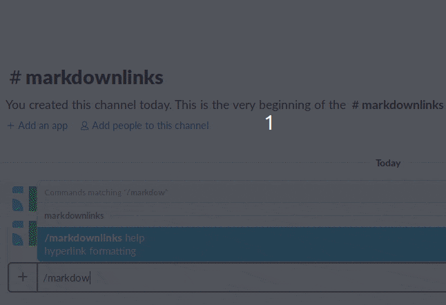

# [Welcome to Markdown Links!](https://markdownlinks.io)  

## Overview
This Slack application allows users to format their messages using Markdown syntax for hyperlinks. While Slack supports several ways to format messages, it does not support a way to cleanly format hyperlinks. Consequently, Slack messages may become cluttered by unkempt URLs. Fortunately, Slack does allow for URLs sent through their API to contain a custom format. The Markdown Links application takes advantage of this.

Slack users activate Markdown Links through the _/markdownlinks_ slash command. Each user can type a message that contains hyperlinks and their associated text, using Markdown hyperlink syntax. This application supports up to twenty hyperlinks in a single message. Additionally, other Slack formatting -such as emojis and strikethroughs- are preserved. Once the user sends the message, Markdown Links will delete the original message and replace it with a message with the hyperlinks cleanly formatted. 

Because the returned message is shown as being from 'markdownlinks', the returned message is also signed with the name of the user who originally shared the message. Additionally, the returned message may be "pinned" to keep its contents easily accessible.

## Demonstration

## Installing the application
To install and use Markdown Links on Slack:
1) Sign into the workspace where the application will be used
2) Authorize the application by clicking the attached button

## Providing feedback
To report a bug or request a feature, open an issue in this repository. Alternatively, you may send a message to miller.tim108@gmail.com.

### Security alerts
Please do not post security vulnerabilities to GitHub. Please send security concerns directly to miller.tim108@gmail.com.

## Contributing to the code base
We welcome contributions from new developers. Pick an issue or create your own and then make a pull request.

### Technology
- [node.js 11](https://nodejs.org/)
- [express.js 4.16](https://expressjs.com/)
- [pug 2.0](https://pugjs.org/)
- [jquery 3.4.1](https://jquery.com)

please review the `package.json` file for a full list of dependencies

### Local setup
The code base may be run using Docker or a traditional setup.

#### In Docker
1. Install [Docker](https://docs.docker.com/install/) (This may require a Unix/Linux kernel or a professional edition license for Windows)
2. Build the docker image
   - `docker build -t <your username>/markdownlinks .`
3. Run the Docker container
   - `docker run -p 4390:4390 -d <your username>/markdownlinks`
4. Visit in web browser
   - `localhost:4390`

#### On machine
1. Install [Node 11](https://nodejs.org/)
2. Install dependencies
   - `npm install`
3. Run
   - `npx nodemon` with [auto reload](https://nodemon.io/) (recommended)
   - `npm start` without auto reload
4. Visit in web browser
   - `localhost:4390`

### Local testing (linux)
1. [Create an application](https://api.slack.com/tutorials) in a Slack workspace
2. Edit slack slash commands
   - `https://api.slack.com/apps/**<your-app-id>**/slash-commands?saved=1`
3. Create `config.sh` file from `config.ex.sh` sample
4. Copy `SLACK_CLIENT_ID` and `SLACK_CLIENT_SECRET` into .gitignore'd `config.sh` file
5. Load credentials onto machine with `source config.sh`
6. [Tunnel into ngrok](https://api.slack.com/tutorials/tunneling-with-ngrok)
   - `ngrok http 4390`
7. [Linting](https://eslint.org/docs/user-guide/getting-started)
   - `npx eslint *.js`
8. Tesing with [jest](https://jestjs.io/)
   - `npm test`

## Thank you for visiting
