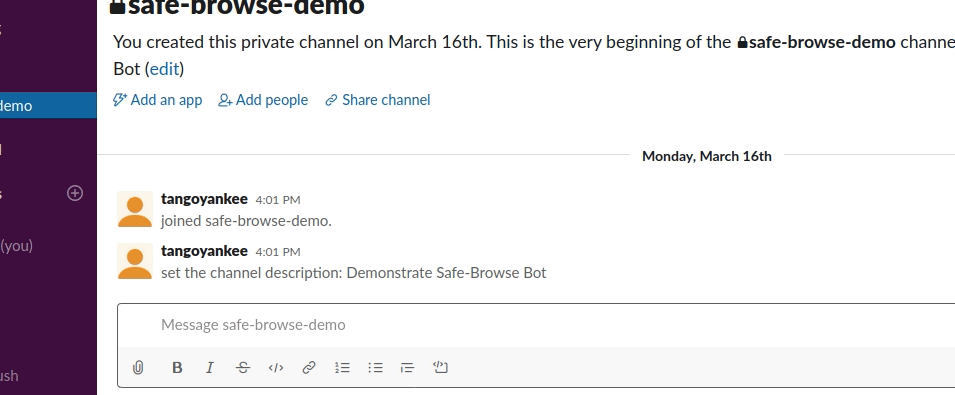

# Welcome to Safe Browse for Slack!  

  

## Overview
This Slack application allows users to check urls for threats reported through Google's Safe Browse API.

Slack users activate the check through the _/safebrowse_ slash command. Each user can copy in suspicious urls and safe-browse-slack will return a report of
suspected threats.

## Demo
 -->

## Installing the application
To install and use Safe Browse for Slack:
1) Sign into the workspace where the application will be used
2) Authorize the application by clicking the attached button

## Providing feedback
To report a bug or request a feature, open an issue in this repository. Alternatively, you may send a message to miller.tim108@gmail.com.

### Security alerts
Please do not post security vulnerabilities to GitHub. Please send security concerns directly to miller.tim108@gmail.com.

## Contributing to the code base
Contributions are welcomed from other developers. Pick an issue or create your own and then make a pull request.

### Technology
- [node.js 11](https://nodejs.org/)
- [express.js 4.16](https://expressjs.com/)
- [pug 2.0](https://pugjs.org/)
- [jquery 3.4.1](https://jquery.com)
- [jest](https://jestjs.io/)

please review the `package.json` file for a full list of dependencies

### Local setup
The code base may be run using Docker or a traditional setup.

#### In Docker
1. Install [Docker](https://docs.docker.com/install/) (This may require a Unix/Linux kernel or a professional edition license for Windows)
2. Build the docker image
   - `docker build -t <your username>/safe-browse-slack .`
3. Run the Docker container
   - `docker run -p 4390:4390 -d <your username>/safe-browse-slack`
4. Visit in web browser
   - `localhost:4390`

#### On machine
1. Install [Node 11](https://nodejs.org/)
2. Install dependencies
   - `npm install`
3. Run
   - `npx nodemon` with [auto reload](https://nodemon.io/) (recommended)
   - `npm start` without auto reload
4. Visit in web browser
   - `localhost:4390`

### Local testing (linux)
1. [Create an application](https://api.slack.com/tutorials) in a Slack workspace
2. Edit slack slash commands
   - `https://api.slack.com/apps/**<your-app-id>**/slash-commands?saved=1`
3. Create `config.sh` file from `config.ex.sh` sample
4. Copy `SLACK_CLIENT_ID` and `SLACK_CLIENT_SECRET` into .gitignore'd `config.sh` file
5. Load credentials onto machine with `source config.sh`
6. [Tunnel into ngrok](https://api.slack.com/tutorials/tunneling-with-ngrok)
   - `ngrok http 4390` or
   - `./ngrok http 4390`
7. [Linting](https://eslint.org/docs/user-guide/getting-started)
   - `npm run lint` or
   - `npx .eslint [filename]`
8. Tesing with [jest](https://jestjs.io/)
   - `npm test` or
   - `npm test [file name]`
